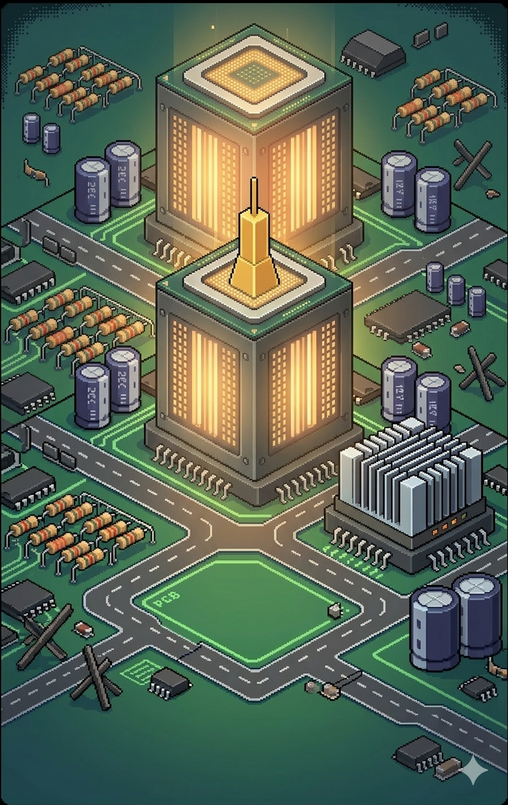

# CPU Quest – edukacyjna gra platformowa**CPU Quest** to gra platformowa napisana w Pythonie z użyciem biblioteki Pygame, łącząca rozrywkę z elementami wiedzy o architekturze komputerów. Projekt powstał na potrzeby przedmiotu *Organizacja Systemów Komputerowych* na Politechnice Gdańskiej.## 🎮 Opis gryWcielasz się w procesor, który musi zebrać wszystkie monety (dane) i rejestry (AX, BX, CX, DX) na kolejnych poziomach. Uważaj na drony – symbolizują one przerwania sprzętowe i zadają obrażenia, gdy flaga I jest włączona. Po zebraniu wszystkich przedmiotów przechodzisz do następnego poziomu.### ✨ Funkcjonalności- **Trzy poziomy** o rosnącym stopniu trudności, odblokowywane sekwencyjnie.- **Sklep** – za zebrane monety możesz kupować nowe skórki postaci.- **Wybór postaci** – spośród odblokowanych skórek (Wojska Lądowe, Żandarmeria, WOC, GROM).- **Edukacyjny pasek ciekawostek** – na dole ekranu wyświetlane są losowe fakty z architektury komputerów (zmiana co 3 sekundy).- **Symulacja procesora** – na ekranie gry widzisz: tryb (Real/Protected), flagę I, licznik rozkazów (PC).- **Zegar RTC** – wyświetlany aktualny czas systemowy.- **Pełne sterowanie klawiaturą i myszą**.### 🕹️ Sterowanie- **Strzałki / WASD** – ruch w lewo/prawo- **Spacja** – skok- **I** – przełączenie flagi I (przerwania aktywne, gdy flaga = 1)- **ESC** – powrót do menu głównego (w trakcie gry)## 🛠️ Wymagania- Python 3.7+- Pygame (`pip install pygame`)## 📦 Instalacja i uruchomienie1. Sklonuj repozytorium:   ```bash   git clone https://github.com/twoja-nazwa/cpu-quest.git   cd cpu-quest

Zainstaluj Pygame:

bash

pip install pygame

Upewnij się, że folder zdjecia zawiera wszystkie pliki graficzne (patrz poniżej).

Uruchom grę:

bash

python cpu_quest.py

📁 Struktura plików

text

cpu-quest/├── cpu_quest.py          # główny plik gry├── zdjecia/               # folder z grafikami│   ├── logo.png│   ├── tlo.png│   ├── tlo_postacie.png│   ├── poziomy_wybor_tlo.png│   ├── tlo_poziom1.png│   ├── tlo_poziom2.png│   ├── tlo_poziom3.png│   ├── dron.png│   ├── moneta.png│   ├── ax.png, bx.png, cx.png, dx.png│   ├── ram.png│   ├── zmechol.png        # skórka Wojska Lądowe│   ├── rzeton.png          # skórka Żandarmeria│   ├── encepence.png       # skórka WOC│   └── grom.png            # skórka GROM└── README.md

W przypadku braku któregoś z plików graficznych gra użyje zastępczych kolorów.

🧠 Ciekawostki (lista)

Pasek na dole ekranu wyświetla losowe fakty, m.in.:

Podział jednostki centralnej na kilka jednostek funkcjonalnych.

Znaczenie flag I i D w procesorach x86.

Różnice między trybem rzeczywistym a chronionym.

Zastosowanie układów 8255, 8254, DMA.

Architektura ARM i bankowanie rejestrów.

👥 Autorzy

Michał Kowalski

Hubert Kowalski

Projekt zrealizowany w ramach laboratorium z Organizacji Systemów Komputerowych na Wydziale Elektroniki, Telekomunikacji i Informatyki Politechniki Gdańskiej.

📄 Licencja

Kod źródłowy jest dostępny na licencji MIT. Grafiki są własnością autorów i nie mogą być wykorzystywane komercyjnie bez zgody.


